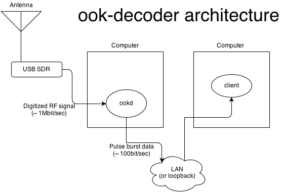

ook-decoder
===========

Ook-decoder reads On-Off Keying radio data commonly used in the 433MHz ISM bands using a software defined radio (SDR).

Status - alpha
--------------

ON HOLD: My test rig is 500 miles away and unreachable during winter months. The transmitter
has failed, so no more development until the spring thaw comes and I can get a human out there.

I'm just filling this repository now, you probably don't want to use it yet.

Installing
--------

    $ make
    $ make install

Abstract
--------

On-Off-Keying (OOK) is a simple radio modulation scheme where the
carrier is pulsed on and off to encode data. Morse code is a well known
historical example. In modern times OOK is commonly used in the
Industrial, Scientific, and Medical (ISM) radio bands (433MHz, 900MHz, and others) by simple
telemetry devices like weather stations, remote thermometers, 
alarm systems, and other remote sensors.

### Modern OOK in ISM ###

These devices are generally cobbled together by embedded system
electrical engineers who didn't study advanced encoding techniques,
believe in simplicity, and are using the smallest, cheapest
microcontroller possible. Typically short pulses and long pulses are
used to encode ones and zeros in an arbitrary polarity. Sometimes
distance between the pulses carries the data, or carries bits of its
own. Generally there are one or more start pulses to let the receiver's
automatic gain control (AGC) sort itself out before the data comes
rolling in.

It seems unlikely to imagine a general solution to decode all of the
protocols imagined by the engineers, to that end, this software is
split into two layers.

### Structure of ook-decoder ###

**ookd** receives and analyzes the RF data looking for bursts of
pulses. When it finds a pulse burst it multicasts the pulses to an
arbitrary number of listens. ookd doesn't know anything
about any specific protocol. Most of the computation takes place in
ookd. In a typical environment ookd will receive and perform
computation on 2MB/s and pass on less than 100B/s. You should not need
to alter ookd to support a new device.

Decoding processes receive the multicast pulse bursts and attempt
to decode them.  For development simplicity it is envisioned that each
type of device will have its own decoder process. A typical decoder
would look at the length of the pulse stream, the length of individual
pulses, and the plausibility of the data to decide if it has received
a valid message from a device it understands. It can then take
whatever action it wishes.

**ookdump** is a client which characterizes and dumps received
bursts.  You will find it useful for understanding your device's
protocol and if you are lucky how to set the parameters to an already
existing function to convert your pulse stream into an array of bytes.

**wh1080** decodes weather information from Fine Offset wh1080/wh1081 based weather stations. These are sold under many brand names. Mine is an Ambient Weather. If you get 
a burst or two of 88 pulses every 45 seconds, you are probably a wh1080. This saves a json file with the current observations and also writes periodic files of accumulated data.

**???** Add the LaCrosse reader here.

The rtl-sdr library and the ook library itself are linked statically to 
avoid build complexity.

Dependencies
------------

### Unix-like OS ###

I build and test on Linux and Mac OS X. Others probably work. If you feel you must send me a Windows patch, make it *very* clean.

### rtl-sdr ###
[rtl-sdr](http://sdr.osmocom.org/trac/wiki/rtl-sdr) uses the software defined radio in common USB TV receivers to capture raw RF data and deliver it to your process. Although I have licensed my code freely, this rtl-sdr is GPL2 and propagates its GPL2 requirements to my code if you distribute a binary. If that is a problem for you, then write your own rtl-sdr replacement.

If you would rather use a hardware 433MHz receiver you could dispense with the SDR section and multicast pulse data directly from your receiver's data line. All of the decoders would still work.

### C99 compiler ###
Either gcc or clang works fine. It also needs to support the non-standard ({ }) *statement expression* extension. (That see's limited use and you could patch around it easily if you need to.) Just be happy I refrained from using blocks in clang for the sake of gcc users.

Notes
-----

### Performance ###

On an original BeagleBone at 250ksps ookd will consume about 30% of the CPU. This is almost entirely because I am doing floating point math and I suspect it is all soft float because of my Debian variant. The clang code is faster than the gcc code with the compilers in Debian Wheezy.

In general, ookd matters for performance, but the clients don't. The data reduction between the two is just too large for the clients to matter.

### Building on Mac OS X ###

You will need the rtl-sdr library to build. You can install this with:

    $ brew install librtlsdr

If you have to build rtl-sdr, you will need to install a bunch of utilities. I made it build with:

    $ sudo chmod 2775 /usr/local/include
    $ brew install cmake
    $ brew install pkgconfig
    $ brew install libusb
    $ mkdir build
    $ cd build
    $ cmake ..
    $ make
    $ make install
    

Credits
-------

[rtl-433](https://github.com/merbanan/rtl_433) was helpful for getting started. It provides a great deal of analysis of the 433MHz signals.
